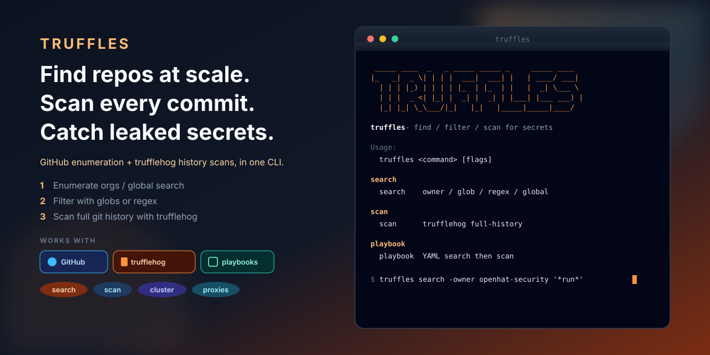
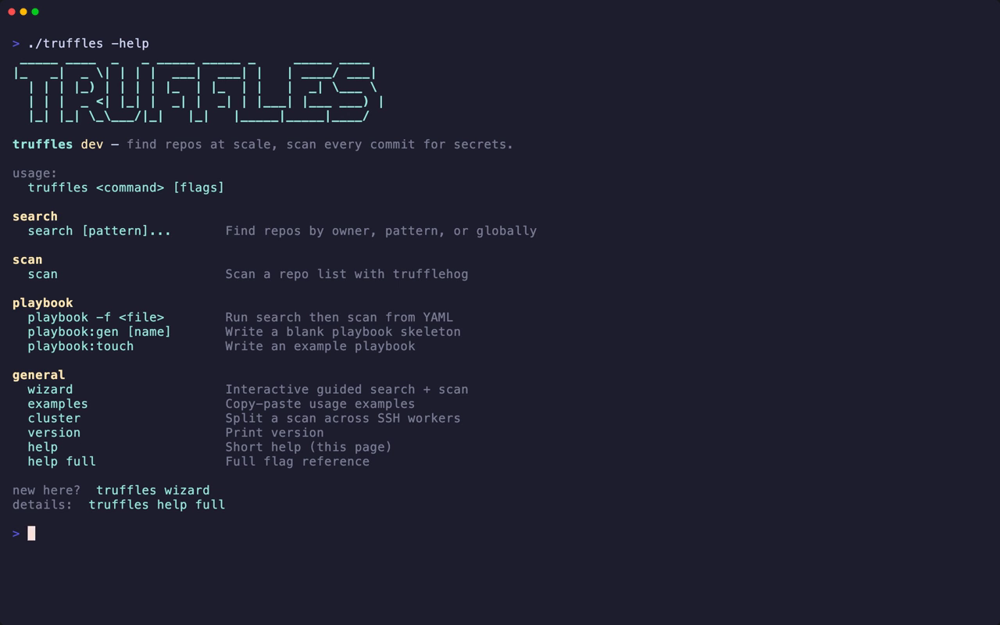

# truffles

<p align="center">
  
</p>

**Find GitHub repos at scale. Scan every commit. Catch leaked secrets.**

Enumerate owners or search globally (with a proxy pool for rate limits), filter by glob or regex, then scan full git history with [trufflehog](https://github.com/trufflesecurity/trufflehog). Or write a YAML playbook and run both steps in one shot.

[](https://github.com/openhat-security/truffles/actions/workflows/ci.yml)
[](https://go.dev)
[](LICENSE)

<p align="center">
  
</p>

<p align="center">
  
</p>

## Install

```bash
# from source
git clone https://github.com/openhat-security/truffles
cd truffles
make build          # → ./truffles
make install        # or: go install ./cmd/truffles

# direct binary (macOS / Linux)
curl -fsSL https://raw.githubusercontent.com/openhat-security/truffles/main/scripts/install.sh | bash

# Go
go install github.com/adamsiwiec/truffles/cmd/truffles@latest
```

Requires [`trufflehog`](https://github.com/trufflesecurity/trufflehog) on `PATH` for `scan` (override with `-bin`). A GitHub token is optional for public search and required for private repos.

## Quick start

```bash
# guided walkthrough (search + scan)
./truffles wizard

# every public repo under an org
./truffles search -owner openhat-security -out repos.txt

# glob filter (repo names matching *run*)
./truffles search -owner openhat-security '*run*' -out repos.txt

# scan history
./truffles scan -f repos.txt

# or: author a playbook and run both steps
vim playbook.yaml
./truffles playbook -f playbook.yaml
```

```bash
./truffles                # banner + short help
./truffles -help          # same short help
./truffles help full      # full flag reference
./truffles examples
./truffles wizard         # interactive setup
```

## wizard

New here? Run `truffles wizard`. It walks you through owner vs global search, optional filters, writing a repo list, and kicking off a scan — same pipeline as the commands above, without memorizing flags.

## Tips

- Status lines: `[ok]` clean · `[++]` findings · `[!!]` **not scanned** (never counted as clean).
- Reports default to a timestamped file and are fsynced after every repo — Ctrl-C keeps what finished.
- `-format pretty|csv|jsonl`. Colour respects `NO_COLOR` and `-color always|never`.
- `-max-depth N` is **lossy** (misses old commits). Prefer full history when secrets matter.
- **Record demo GIFs:** `brew install vhs && make demo-vhs TAPE=quickstart` → `assets/screenshots/quickstart.{gif,mp4}`. Other tapes: [docs/demos.md](docs/demos.md).

## search / scan

**Enumeration** (`-owner`) lists every public repo, then filters locally with globs or `-regex`.

**Global search** (no `-owner`) hits GitHub's search API; `-q` is repeatable and `-filter` narrows locally.

`scan` reads a URL list and runs trufflehog. Progress stays on stderr; the report goes to `-out`.

Deep notes (proxy pool, durability, measured performance): [docs/architecture.md](docs/architecture.md).

## Security

Reports contain secrets in plaintext. They are gitignored by default — keep them out of version control. Use `-results verified` when you want only confirmed-live credentials. Rotation, not deletion, removes a leaked secret from GitHub history.

## License & contributing

[LICENSE](LICENSE) · [CONTRIBUTING.md](CONTRIBUTING.md) · [CHANGELOG.md](CHANGELOG.md)

`make check` is what CI runs.
